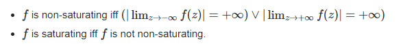

# top-k error rate

~~~properties
 where the top-5 error rate is the fraction of test images for which the correct label is not among the five labels considered most probable by the mode.
~~~

First, you make a prediction using the CNN and obtain the predicted class multinomial distribution 

Now, in the case of **top-1** score, you check if the top class (the one having the highest probability) is the same as the target label.

In the case of **top-5** score, you check if the target label is one of your top 5 predictions (the 5 ones with the highest probabilities). 

In both cases, the top score is computed as the times a predicted  label matched the target label, divided by the number of data-points  evaluated.

Finally, when 5-CNNs are used, you first average their predictions  and follow the same procedure for calculating the top-1 and top-5  scores. 

# subtracting the meaning activity over the training set from each pixel

~~~properties
一种较为可靠的说明是:
将训练集每个图像对应像素的R,G,B三个值分别求平均数, 然后每个图像的每个像素的R值减去R平均, G值减去G平均, B值减去B平均
~~~

# 饱和线性 - 非饱和线性:

~~~shell
直观解释: 饱和激活函数会压缩输入值
~~~

1. 对于Rectified Linear Unit(ReLU)激活函数: f(x) = max(0, x)x趋于正无穷时 f(x)也趋于正无穷=> 非饱和

2. sigmoid函数: f(x) 范围是[0, 1]  => 饱和的
3. tanh(双曲正切)函数: f(x) 范围是[-1, 1] => 饱和的

# Rectifier(矫正器) Linear Units(ReLUs):

https://www.kaggle.com/dansbecker/rectified-linear-units-relu-in-deep-learning

# interaction effect:

What is an interactive effect?  It is when one variable A affects a prediction differently depending on the value of B. 

# pooling layer:

The pooling layer operates upon each feature map separately to create a new set of the same number of pooled feature maps.

Pooling involves selecting a pooling operation, much like a filter to be applied to feature maps. The size of the pooling operation or filter is smaller than the size of the feature map; specifically, it is almost always 2×2 pixels applied with a stride of 2 pixels.

This means that the pooling layer will always reduce the size of each feature map by a factor of 2, e.g. each dimension is halved, reducing  the number of pixels or values in each feature map to one quarter the  size. For example, a pooling layer applied to a feature map of 6×6 (36  pixels) will result in an output pooled feature map of 3×3 (9 pixels).

The pooling operation is specified, rather than learned. Two common functions used in the pooling operation are:

-  **Average Pooling**: Calculate the average value for each patch on the feature map.
-  **Maximum Pooling (or Max Pooling)**: Calculate the maximum value for each patch of the feature map.

(依次选取一个n*n的小方阵, 用一个新的像素点, 其值为这些像素的平均值/最大值/最小值, 代替整个方阵)