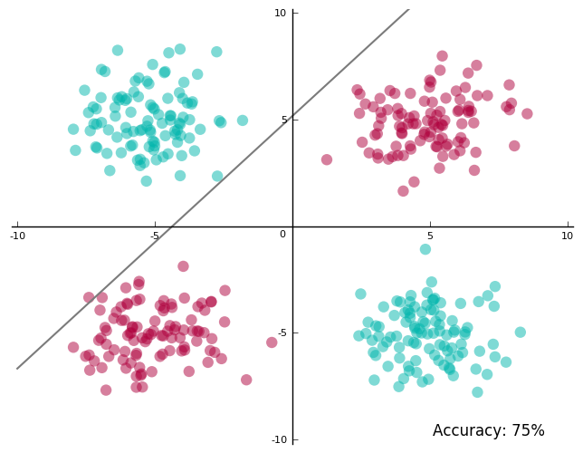
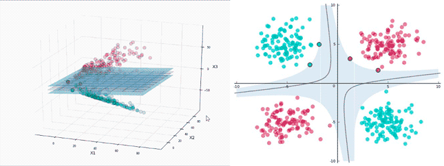
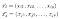
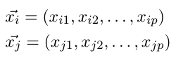
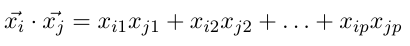
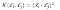
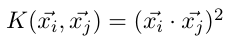
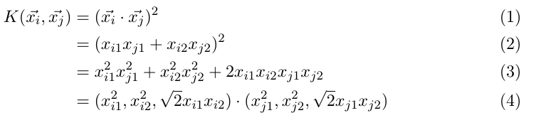
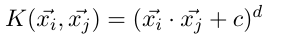

# 1. svm简介:

支持向量机是一种二分类模型, 它是定义在特征空间的间隔最大的线性分类器, 间隔最大的线性分类器. 间隔最大使它有别于感知机.

---

SVM包括核技巧, 这使它成为实质上的非线性分类器.

---

SVM的学习算法就是求解凸二次规划的最优化算法.

https://blog.statsbot.co/support-vector-machines-tutorial-c1618e635e93

### 分类的意义不在于能对训练数据划分的有多好, 预测未知的数据更重要

---

### Goal:

### 1. Find lines that correctly classify the training data

### 2. Among all such lines, pick the one that has the greatest distance to the points closest to it. 

The closest points that identify this line are known as support vectors.

The region they define around the line is known as the margin. 

---

#### 支持向量机能处理许多维:

2维中: classifier是线

3维中:classifier是一个面

更多维中, classifier 是一个超平面(hyperplane)

---

Allowing for Errors: 使用线性分类器, 并不总能划分所有的点 => 

Non-linearly Separable Data

[the famous XOR dataset]

Project the data into a space where it is linearly separable and find a hyperplane in this space.
$$
the\ new\ coordinates\begin{cases}
X_1 = x^2_1\\
X_2 = x^2_2\\
X_3 = \sqrt{2} X_1 x_2
\end{cases}
$$

run SVM on it:

project back to the original two-dimensional space:

---

the margin

Kernel: SVM use it to do the projection

基于以下事实:

1. For linearly separable data SVMs work amazingly well.
2. For data that’s almost linearly separable, SVMs can still be made to work pretty well by using the right value of C.
3. For data that’s not linearly separable, we can project data to a space where it is perfectly/almost linearly separable, which reduces the problem to 1 or 2 and we are back in business.

A very surprising aspect of SVMs is that in all of the mathematical machinery it uses, the exact projection, or even the number of dimensions, doesn’t show up. You could write all of it in terms of the *dot products* between various data points (represented as vectors). For *p*-dimensional vectors *i* and *j* where the first subscript on a dimension identifies the point and the second indicates the dimension number:

The dot product is defined as:

A kernel , short for kernel function, takes as input two points in the original space, and directly gives us the dot product in projected space.

I claim this kernel function gives me the same result:

We take the dot product of the vectors in the original space *first*, and then square the result.

Let expand it out and check whether my claim is indeed true:

Most SVM libraries already come pre-packaged with some popular kernels like <u>*Polynomial,</u> <u>Radial Basis Function</u> (RBF)*, and <u>*Sigmoid.</u>  When we don’t use a projection (as in our first example in this article), we compute the dot products in the original space — this we refer to as using the *linear kernel*.

Many of these kernels give you additional levers to further tune it for your data. For example, the polynomial kernel:

allows you to pick the value of *c* and *d* (the degree of the polynomial). For the 3D projection above, I had used a polynomial kernel with *c=0* and *d=2*.

*A kernel function computes what the dot product would be if you had actually projected the data.*

## summary

1. We typically don’t define a specific projection for our data. Instead, we pick from available kernels, tweaking them in some cases, to find one best suited to the data.
2. Of course, nothing stops us from defining our own kernels, or performing the projection ourselves, but in many cases we don’t need to. Or we at least start by trying out what’s already available.
3. If there is a kernel available for the projection we want, we prefer to use the kernel, because that’s often faster.
4. RBF kernels can project points to infinite dimensions.

# **SVM libraries to get started**

There are quite a few SVM libraries you could start practicing with:
• [libSVM](https://www.csie.ntu.edu.tw/~cjlin/libsvm/)

• [SVM-Light](http://svmlight.joachims.org/)
• [SVMTorch](http://bengio.abracadoudou.com/SVMTorch.html)

Many general ML libraries like [scikit-learn](http://scikit-learn.org/stable/) also offer SVM modules, which are often wrappers around dedicated SVM libraries. My recommendation is to start out with the tried and tested [*libSVM*](https://www.csie.ntu.edu.tw/~cjlin/libsvm/).

libSVM is available as a commandline tool, but the download also bundles Python, Java, and Matlab wrappers. As long as you have a file with your data in a format libSVM understands (the README that’s part of the download explains this, along with other available options) you are good to go.