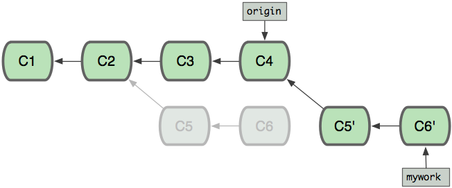

### 取消缓存:

~~~shell
git reset HEAD  # 取消git add 提交的文件
git reset HEAD a.txt #取消指定文件的缓存
~~~

### 获取代码:

~~~shell
git fetch <hubname> <branch>  #只拉取不合并
git pull ...		# 拉取并合并
git pull ..  --no-edit  # 合并后提交时将不会弹出editor, 同时默认接收自动生成的信息
~~~

### 合并代码:

~~~shell
git reset --merge # 取消合并
git merge <branch> # 将目标分支代码合并到当前分支, 提交记录交汇
git rebase <branch> # 将目标代码合并到当前分支,
# 当前分支原先分叉出去的提交删除, 并作为补丁添加到最新提交上
~~~

### 隐藏当前修改:

~~~shell
git stash
git stash save "message"
git stash pop # 恢复修改
~~~

