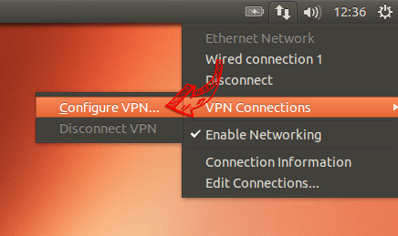
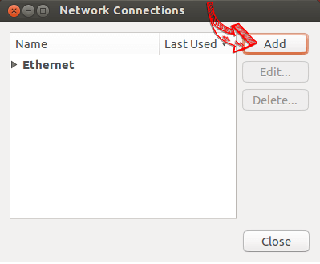
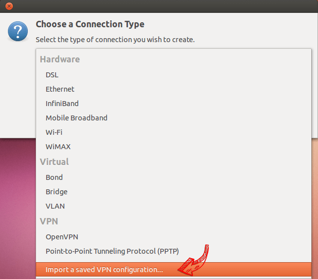
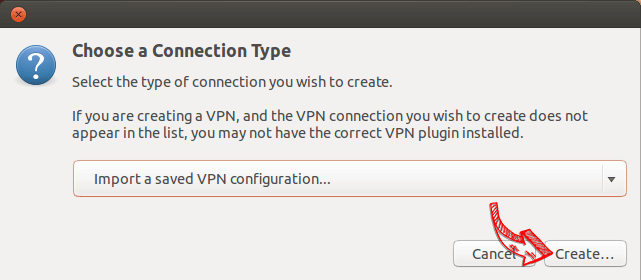
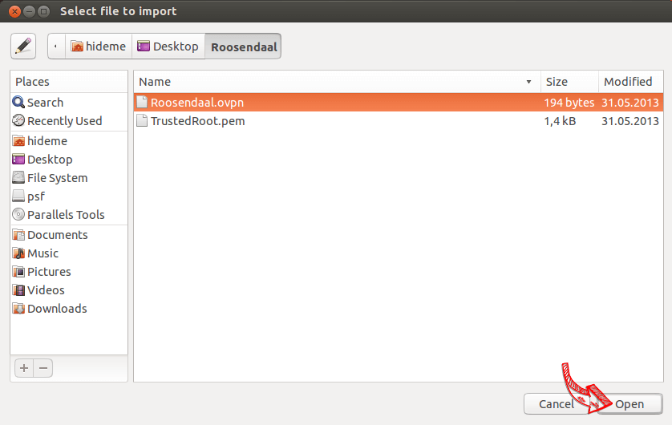
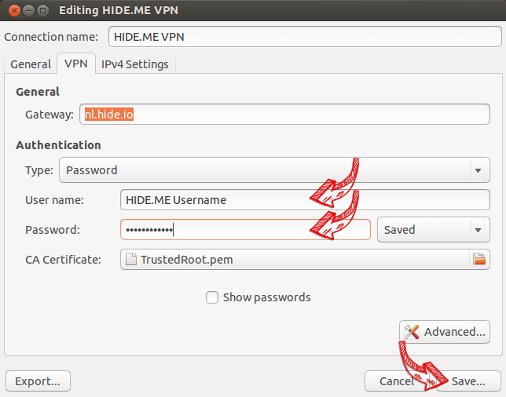
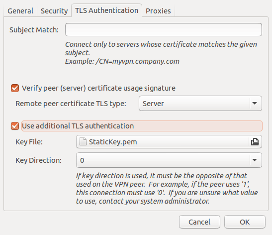
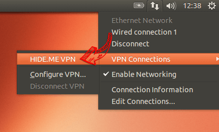
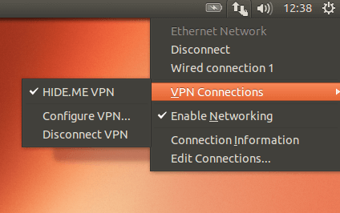

### Step by Step Tutorial

-  ### 1

   **Notice:** This tutorial has been created with Ubuntu 15.10 (Wily Werewolf) and **does not** work with older versions. If you are using an older version please contact our customer support for assistance.

    Open the terminal and install OpenVPN with the following command.

   `sudo apt-get install openvpn network-manager-openvpn network-manager-openvpn-gnome`

   

-  ### 2

   Open the network menu, go to "VPN Connections" and click on "Configure VPN...".

   

-  ### 3

   Click on "Add".

   

-  ### 4

   Click on "Import a saved VPN configuration...".

   

-  ### 5

   Click on "Create".

   

-  ### 6

   Download the [OpenVPN configuration](https://member.hide.me/en/server-status), unzip it and import the .ovpn file.

   

-  ### 7

   Enter your login credentials and click on "Save...".

   

-  ### 7a

   Switch to "Advanced Configuration" and in the tab "TLS Authentication" check  "Use additional TLS authentication". Select the file "StaticKey.pem"  from the configuration and set the "Key Direction" to "0". Confirm with  "OK".

   

-  ### 8

   Open the network menu to establish a VPN connection.

   

-  ### 9

   If connection has been successfully established, the status is shown in  the menu bar. You can manage your VPN connection in the network  settings.

   

[Video Tutorial](https://hide.me/en/vpnsetup/ubuntu/openvpn/#video)[Step by Step Tutorial](https://hide.me/en/vpnsetup/ubuntu/openvpn/#step)

###